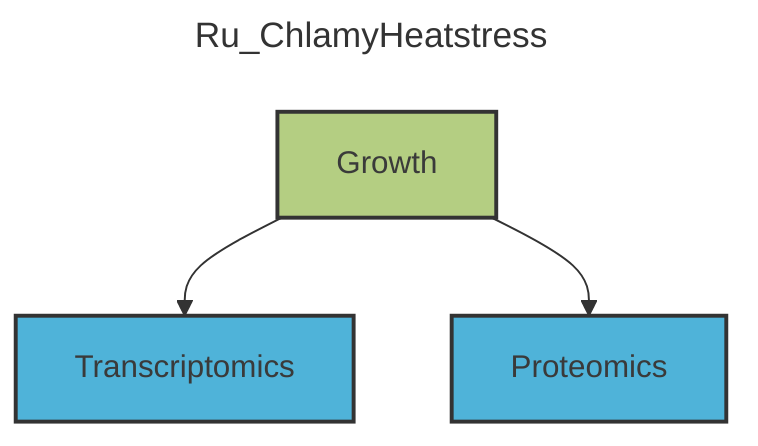

# Chlamydomonas reinhardtii heat stress time course experiment

## Experimental design

**Figure 1:** Experimental design of the heat treatment experiments (Zhang et al. 2022).

## Publication

#### Title
Systems-wide analysis revealed shared and unique responses to moderate and acute high temperatures in the green alga Chlamydomonas reinhardtii. 

#### Citation

Zhang N, Mattoon EM, McHargue W, Venn B, Zimmer D, Pecani K, Jeong J, Anderson CM, Chen C, Berry JC, Xia M, Tzeng SC, Becker E, Pazouki L, Evans B, Cross F, Cheng J, Czymmek KJ, Schroda M, Mühlhaus T, Zhang R. Systems-wide analysis revealed shared and unique responses to moderate and acute high temperatures in the green alga Chlamydomonas reinhardtii. Commun Biol. 2022 May 13;5(1):460. doi: 10.1038/s42003-022-03359-z   . PMID: 35562408  ; PMCID: PMC9106746.  

## Sampling schema

|time point [h]|condition |temperature [°C]|sample name|description|sample taken Proteomics =16|sample taken Transcriptomics =15|
|---|--|--|--|--|--|--|
|-20|control|25|pre1||x||
|-18|control|25|pre2|preheat|x|x|
|0|start heat treatment|25 -> 35/40|HS_T00h|RHT (reach high temperature)|x|x|
|0.5|heat treatment|35/40|HS_T00.5h|-|x|x|
|1|heat treatment|35/40|HS_T01h|-|x|x|
|2|heat treatment|35/40|HS_T02h|-|x|x|
|4|heat treatment|35/40|HS_T04h|-|x|x|
|8|heat treatment|35/40|HS_T08h|-|x|x|
|16|heat treatment|35/40|HS_T16h|-|x|x|
|24|end treatment|35/40 -> 25|HS_T24h|end heat treatment|x|x|
|24|start recovery|25|RE_T00h|RCT (reach control temperature)|x|x|
|26|recovery|25|RE_T02h|-|x|x|
|28|recovery|25|RE_T04h|-|x|x|
|32|recovery|25|RE_T08h|-|x|x|
|48|recovery|25|RE_T24h|-|x|x|
|72|recovery|25|RE_T48h|-|x|x|

|Technology|temperature treatments|timepoints|replicates|sample count|
|--|--|--|--|--|
|Proteomics|2|16|3|**96**|
|Transcriptomics|2|15|3|**90**|

<!--- Start of automated section -->

# Systems-wide investigation of responses to moderate and acute high temperatures in the green alga Chlamydomonas reinhardtii.

### Description
Algae cultures were grown mixotrophically (TAP). After 24h of 35°C/40°C the cells were shifted back to room temperature for 48h. 'omics samples were taken.

## Table of Contents 

- [ISA Graph](#relationships-between-assays-and-studies)
- [Overview Table](#overview-table)
- [Contacts](#contacts)
- [Publication](#publication)
- Studies 
 
     - [Growth](#study-growth)
- Assays 
 
     - [Transcriptomics](#assay-transcriptomics)
     - [Proteomics](#assay-proteomics)

## Relationships between Assays and Studies 
 

 
## Overview Table

| Meta Data | Description |
| --------- | ----------- |
| Submission Date | Fri May 13 2022 02:00:00 GMT+0200 (Central European Summer Time) |
| Study identifiers | Growth |
| Study Count | 1 |
| Assay identifiers | Transcriptomics , Proteomics |
| Assay Count | 2 |

## Contacts 
 
| Names | Email | Address | Affiliation | ORCID |
| ----- | ----- | ------- | ----------- | ----- |
| Ningning  Zhang | nzhang@danforthcenter.org | St. Louis, Missouri, 63132, USA | Donald Danforth Plant Science Center |  | 
 | Erin M Mattoon | EMattoon@danforthcenter.org | St. Louis, Missouri, 63132, USA | Donald Danforth Plant Science Center |  | 
 | Will  McHargue | wmchargue@wustl.edu | St. Louis, Missouri, 63132, USA | Donald Danforth Plant Science Center | 0000-0001-5411-0473 | 
 | Benedikt  Venn | venn@bio.uni-kl.de | TU Kaiserslautern, Kaiserslautern, 67663, Germany | Computational Systems Biology | 0000-0003-4203-1596 | 
 | David  Zimmer | davidzimmer91@gmail.com | TU Kaiserslautern, Kaiserslautern, 67663, Germany | Computational Systems Biology | 0000-0002-7832-7658 | 
 | Kresti  Pecani | kpecani@rockefeller.edu | New York, New York, 10065, USA | The Rockefeller University |  | 
 | Jooyeon  Jeong | jyjeong@illinois.edu | St. Louis, Missouri, 63132, USA | Donald Danforth Plant Science Center |  | 
 | Cheyenne M Anderson | Cheyenne.Anderson1@hotmail.com | St. Louis, Missouri, 63132, USA | Donald Danforth Plant Science Center |  | 
 | Chen  Chen | chen.chen@mail.missouri.edu | Columbia, Missouri, 65211, USA | University of Missouri-Columbia |  | 
 | Jeffrey C Berry | JBerry@danforthcenter.org | St. Louis, Missouri, 63132, USA | Donald Danforth Plant Science Center |  | 
 | Ming  Xia | cxia@danforthcenter.org | St. Louis, Missouri, 63132, USA | Donald Danforth Plant Science Center |  | 
 | Shin-Cheng  Tzeng | STzeng@danforthcenter.org | St. Louis, Missouri, 63132, USA | Donald Danforth Plant Science Center | 0000-0002-1095-7418 | 
 | Eric  Becker | ebbz72@gmail.com | St. Louis, Missouri, 63132, USA | Donald Danforth Plant Science Center |  | 
 | Leila  Pazouki | lpazouki@danforthcenter.org | St. Louis, Missouri, 63132, USA | Donald Danforth Plant Science Center |  | 
 | Bradley  Evans | BEvans@danforthcenter.org | St. Louis, Missouri, 63132, USA | Donald Danforth Plant Science Center |  | 
 | Fred  Cross | fred.r.cross@gmail.com | New York, New York, 10065, USA | The Rockefeller University |  | 
 | Jianlin  Cheng | chengji@missouri.edu | Columbia, Missouri, 65211, USA | University of Missouri-Columbia |  | 
 | Kirk J Czymmek | KCzymmek@danforthcenter.org | St. Louis, Missouri, 63132, USA | Donald Danforth Plant Science Center | 0000-0002-5471-7395 | 
 | Michael  Schroda | schroda@bio.uni-kl.de | TU Kaiserslautern, Kaiserslautern, 67663, Germany | Division Biotechnology and Systems Biology | 0000-0001-6872-0483 | 
 | Timo  Mühlhaus | timo.muehlhaus@rptu.de | TU Kaiserslautern, Kaiserslautern, 67663, Germany | Computational Systems Biology | 0000-0003-3925-6778 | 
 | Ru  Zhang | ruzhang.danforthcenter@gmail.com | St. Louis, Missouri, 63132, USA | Donald Danforth Plant Science Center | 0000-0002-4860-7800 |

## Publication 

| Meta Data | Description |
| ----------- | ----------- |
| Title | Systems-wide analysis revealed shared and unique responses to moderate and acute high temperatures in the green alga Chlamydomonas reinhardtii |
| Authors | Ningning Zhang, Erin M. Mattoon, Will McHargue, Benedikt Venn, David Zimmer, Kresti Pecani, Jooyeon Jeong, Cheyenne M. Anderson, Chen Chen, Jeffrey C. Berry, Ming Xia, Shin-Cheng Tzeng, Eric Becker, Leila Pazouki, Bradley Evans, Fred Cross, Jianlin Cheng, Kirk J. Czymmek, Michael Schroda, Timo Mühlhaus & Ru Zhang |
| PubMedID | PMC9106746 |
| DOI | 10.1038/s42003-022-03359-z |
| Current status | published |

## Study: _Growth_

### Description
Unicellular green alga Chlamydomonas reinhardtii were cultivated under highly controlled photobioreactor conditions, namely 24-hour moderate (35°C) and acute (40°C) high temperatures and subsequent recovery at 25°C.

### Additional details 
 | Meta Data | Description |
| --------- | ----------- |
| Table Count | 2 |
| Table Names | Basic setup , Treatment |
| Sample Count | 96 |
| Data File Count | 0 |
| Associated assays | Transcriptomics,Proteomics |
| Genotype | _CC-1690_ |
| Biological replicates | 3 |
| Time points | 1 |

### Annotation headers

**Characteristics**: [Biological replicate](http://purl.obolibrary.org/obo/NFDI4PSO_0000042),[organism](https://bioregistry.io/OBI:0100026),[Genotype](http://purl.obolibrary.org/obo/NFDI4PSO_0000031),[Tissue](https://bioregistry.io/NCIT:C12801),[Condition](https://bioregistry.io/NCIT:C25457)

**Parameters**: `inoculation cell count`,`growth medium`,`bioreactor type`,`bioreactor volume`,`light intensity`,`blue light percentage`,`red light percentage`,`air flow volume`,`experiment date`,`constant cell count`,`time point description`,[Time point](http://purl.obolibrary.org/obo/NFDI4PSO_0000034)

**Factors**: [temperature](https://bioregistry.io/PATO:0000146)

## Assay: _Transcriptomics_

### Additional details 
 | Meta Data | Description |
| --------- | ----------- |
| Measurement Type | Transcriptomics |
| Technology Type | Next Generation Sequencing |
| Technology Platform | Illumina HiSeq 2000 |
| Table Count | 3 |
| Table Names | Harvesting , Extraction , Measurement |
| Sample Count | 180 |
| Data File Count | 180 |
| Associated studies | Growth |

### Annotation headers

**Parameters**: `harvesting method`,`added substance`,`substance concentration`,[sample volume](https://www.ebi.ac.uk/ols4/ontologies/ms/classes/http%253A%252F%252Fpurl.obolibrary.org%252Fobo%252FMS_1000005),`centrifugation force`,`centrifugation temperature`,`centrifugation duration`,[processed material](https://bioregistry.io/OBI:0000047),`freezing method`,`storage temperature`,[Bio entity](http://purl.obolibrary.org/obo/NFDI4PSO_0000012),`resuspension buffer`,`resuspension buffer volume`,[Extraction method](http://purl.obolibrary.org/obo/NFDI4PSO_0000054),[Extraction buffer volume](http://purl.obolibrary.org/obo/NFDI4PSO_0000051),[Library strategy](http://purl.obolibrary.org/obo/NFDI4PSO_0000035),[Library Selection](http://purl.obolibrary.org/obo/NFDI4PSO_0000036),[Library layout](http://purl.obolibrary.org/obo/NFDI4PSO_0000015),`rRNA Depletion`,[Library preparation kit](http://purl.obolibrary.org/obo/NFDI4PSO_0000037),[Library preparation kit version](http://purl.obolibrary.org/obo/NFDI4PSO_0000038),[Library RNA amount](http://purl.obolibrary.org/obo/NFDI4PSO_0000016),[Next generation sequencing instrument model](http://purl.obolibrary.org/obo/NFDI4PSO_0000040),[Base-calling Software](http://purl.obolibrary.org/obo/NFDI4PSO_0000017),[Base-calling Software Version](http://purl.obolibrary.org/obo/NFDI4PSO_0000018),[Library strand](http://purl.obolibrary.org/obo/NFDI4PSO_0000020),[Raw data file format](http://purl.obolibrary.org/obo/NFDI4PSO_0000021)

**Factors**: [RNA quality check](http://purl.obolibrary.org/obo/NFDI4PSO_0000062)

## Assay: _Proteomics_

### Additional details 
 | Meta Data | Description |
| --------- | ----------- |
| Measurement Type | Proteomics |
| Technology Type | Mass Spectrometry |
| Technology Platform | Orbitrap Fusion Lumos |
| Table Count | 4 |
| Table Names | Harvesting , Protein extraction , Measurement , Computation analysis |
| Sample Count | 96 |
| Data File Count | 192 |
| Associated studies | Growth |

### Annotation headers

**Parameters**: `harvesting method`,[sample volume](https://www.ebi.ac.uk/ols4/ontologies/ms/classes/http%253A%252F%252Fpurl.obolibrary.org%252Fobo%252FMS_1000005),`centrifugation force`,`centrifugation temperature`,`centrifugation duration`,`freezing method`,`storage temperature`,`protein extraction method`,[processed material](https://bioregistry.io/OBI:0000047),`approx. protein amount`,`lysis buffer volume`,`processed sample volume`,`solubilization method`,`sonication duration`,`sonication instrument`,`digestion duration`,`digestion temperature`,`peptide purification`,`storage container`,`drying method`,`drying duration`,[MS sample resuspension](http://purl.obolibrary.org/obo/NFDI4PSO_0000044),`resuspension buffer volume`,`Experiment type`,[Quantification method](http://purl.obolibrary.org/obo/PRIDE_0000307),[technical replicate](https://www.ebi.ac.uk/ols4/ontologies/ms/classes/http%253A%252F%252Fpurl.obolibrary.org%252Fobo%252FMS_1001808),[Variable modification](https://www.ebi.ac.uk/ols4/ontologies/ms/classes/http%253A%252F%252Fpurl.obolibrary.org%252Fobo%252FMS_1003022),[Fixed modification](https://www.ebi.ac.uk/ols4/ontologies/ms/classes/http%253A%252F%252Fpurl.obolibrary.org%252Fobo%252FMS_1003021),`injection volume`,`Number of injections`,`HPLC instrument model`,`column type`,`HPLC flow rate`,`HPLC gradient protocol`,[instrument model](https://www.ebi.ac.uk/ols4/ontologies/ms/classes/http%253A%252F%252Fpurl.obolibrary.org%252Fobo%252FMS_1000031),[duration](https://bioregistry.io/PATO:0001309),[analysis software](https://www.ebi.ac.uk/ols4/ontologies/ms/classes/http%253A%252F%252Fpurl.obolibrary.org%252Fobo%252FMS_1001456),`analysis software version`,`genome version`,[protein modifications](https://www.ebi.ac.uk/ols4/ontologies/ms/classes/http%253A%252F%252Fpurl.obolibrary.org%252Fobo%252FMS_1000933),`FDR threshold for peptide spectrum matching and protein identification`

<!--- End of automated section -->